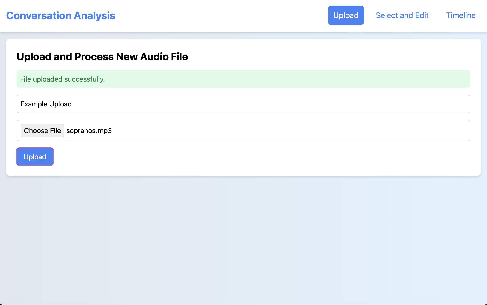
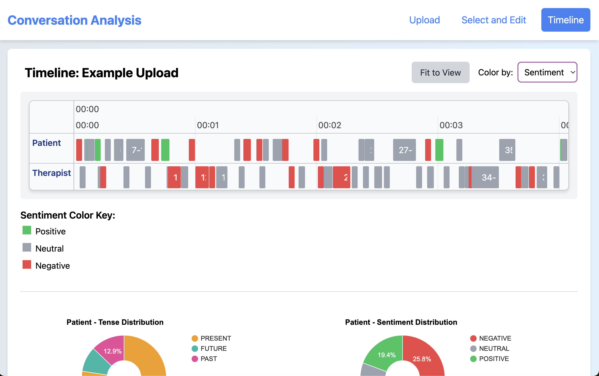

# Conversation Analysis App

## Description

This conversation analysis app allows users to upload audio files containing dialogue and have them processed and visualized across multiple interactive dashboards. The app consists of a backend built on Django REST Framework and a frontend using Vite + React. Features include:

- Speaker Diarization
- Sentiment Analysis
- Timeline Visualization

The app was designed with applications in therapy in mind, for both patients and doctors. The goal was to explore ways of visualizing the overall progression of a conversation and to attempt to extract key moments of insight. This is a public version of the original app, but there was success plotting insight from further algorithms in the context of the timeline interface.

Heading into this project, I had no former experience with either Django or React. The experience served as a strong introduction into the wheelhouse of full stack development, including RESTful API's, Model-View-Controller design, and more.

## Usage

If installation was successful, you will be met with a landing page welcoming you to the app. Click the button to get started.

To upload a file, enter a title for your transcript and select your audio file. Almost any audio file type is accepted (for a full list see the AAI docs [here](https://www.assemblyai.com/docs/concepts/faq)). Click upload and wait until you receive a green banner indicating a successful upload:

Now you can head to the "Select and Edit" page to view your transcript. Here you can view and manage previous uploads, edit title, speaker names, and text, and delete transcripts you no longer want. When editing, be sure to click "Save All Changes" to see your changes reflected.

The "Timeline" page provides interactive insight into your transcript. Each sentence corresponds to its own 'item' on the timeline. To zoom in or out, scroll up or down while the cursor is hovering over the timeline. Click "Fit to View" at any time to revert to the default zoom.

NOTE: the timeline will display data for your currently selected transcript, so head back to the "Select and Edit" page if you wish to view a different one.

Choose to color by tense or sentiment in the dropdown menu to color code the sentence items along with a key.

Clicking on a sentence item will display the text, along with the tense, sentiment, and time frame during which the sentence was spoken. The selected item will be highlighted in yellow.

## Installation

Clone this repository. You will need `node` (for `npm`) and `python3` installed on your machine.

##### Set up backend:

Enter the repository:

`cd conversation-analysis-app-public`

Create virtual environment:

`python3 -m venv .venv`

Activate virtual environment:

`source .venv/bin/activate`

Install required modules:

`python3 -m pip install -r requirements.txt`

Change to backend directory:

`cd backend`

Initialize database schema:

`python3 manage.py migrate`

Run backend server:

`python3 manage.py runserver`

##### Set up frontend:

With the backend server now live, open a new terminal window and navigate back to the top level of the repo.

Enter frontend directory:

`cd frontend`

Install required packages:

`npm install`

Run frontend server:

`npm run dev`

Your site should be live at http://localhost:5173/ !!!

When you are done, don't forget to deactivate venv

`deactivate`

## License

This project is licensed under GPLv3.